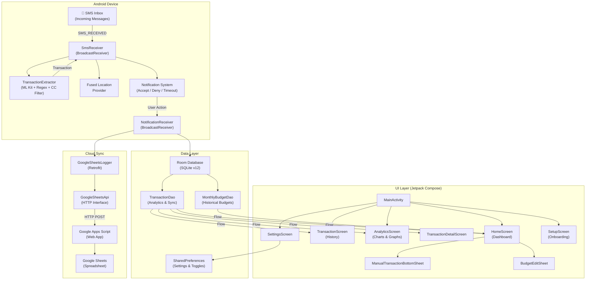
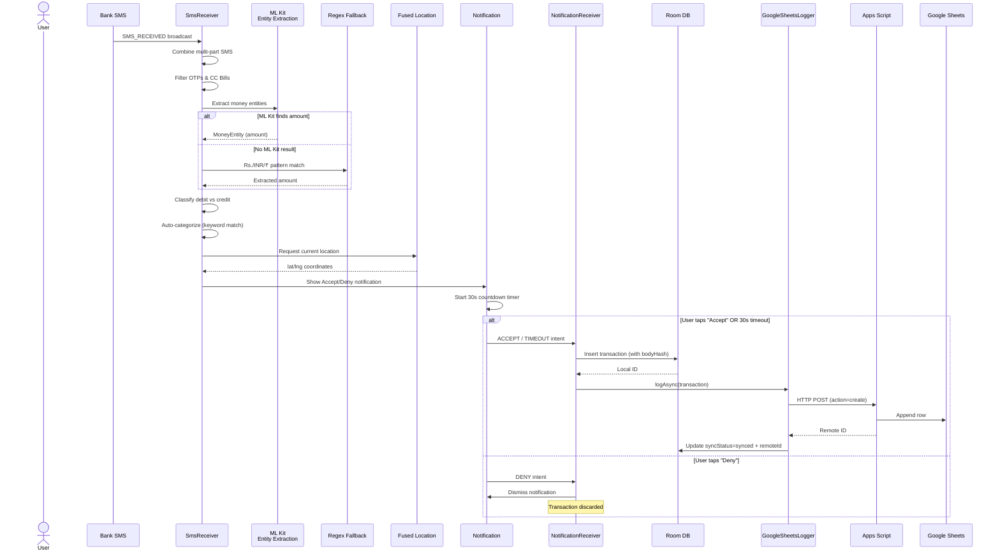
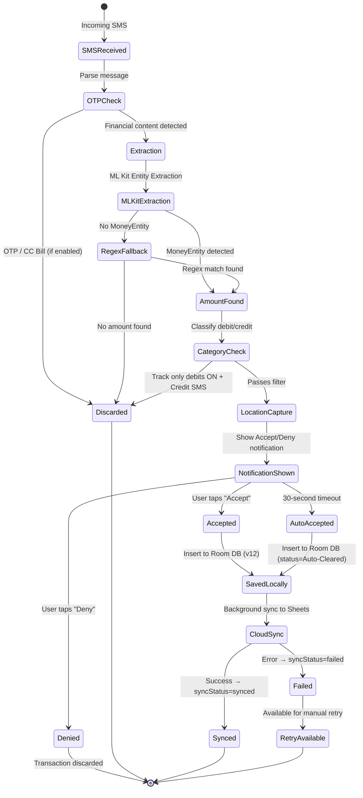
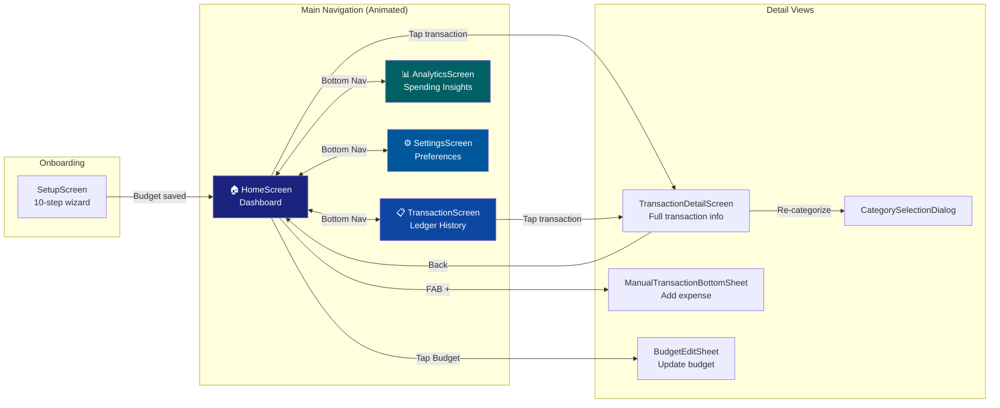

<p align="center">
  
</p>

<h1 align="center">Expense Tracker</h1>

<p align="center">
  <b>AI-Powered Automatic Expense Tracking for Android</b><br/>
  <i>SMS-based transaction detection with ML Kit, real-time notifications, analytics dashboard, geo-tagged spending, and cloud sync to Google Sheets</i>
</p>

<p align="center">
  
  
  
  
  
  
</p>

---

## Table of Contents

- [Overview](#overview)
- [Key Features](#key-features)
- [Architecture](#architecture)
  - [High-Level Architecture](#high-level-architecture)
  - [Data Flow — SMS to Cloud](#data-flow--sms-to-cloud)
  - [Notification & User Decision Flow](#notification--user-decision-flow)
  - [Directory Structure](#directory-structure)
- [Screens & Navigation](#screens--navigation)
- [Transaction Extraction Pipeline](#transaction-extraction-pipeline)
  - [ML Kit Entity Extraction](#ml-kit-entity-extraction)
  - [Regex Fallback](#regex-fallback)
  - [Category Classification](#category-classification)
- [Splitting Expenses](#splitting-expenses)
- [Backup & Restore](#backup--restore)
- [Remote-Updatable Filters](#remote-updatable-filters)
- [Privacy & Security](#privacy--security)
- [Analytics & Budgets](#analytics--budgets)
- [AI Smart Sync (Lazy Sync)](#ai-smart-sync-lazy-sync)
- [Cloud Sync — Google Sheets](#cloud-sync--google-sheets)
  - [Sync Architecture](#sync-architecture)
  - [Apps Script Backend](#apps-script-backend)
  - [API Operations](#api-operations)
- [Data Model](#data-model)
- [Getting Started](#getting-started)
  - [Prerequisites](#prerequisites)
  - [Build & Run](#build--run)
  - [Permissions](#permissions)
  - [Setting Up Cloud Sync](#setting-up-cloud-sync)
- [CI/CD & Automated Releases](#cicd--automated-releases)
- [Tech Stack](#tech-stack)

---

## Overview

**Expense Tracker** is a native Android application that **automatically detects financial transactions from incoming SMS messages** using Google ML Kit's Entity Extraction API. When a bank SMS arrives, the app extracts the amount, determines if it's a debit or credit, classifies it into a spending category, captures the user's GPS location, and presents an actionable notification — all in real-time, without any manual input.

Transactions are persisted locally in a Room database and optionally synced to **Google Sheets** via
Apps Script for cloud backup, cross-device access, and spreadsheet-based analytics.

The UI is built entirely with **Jetpack Compose** and **Material 3**, featuring a premium financial
dashboard with animated navigation, comprehensive spending analytics, gradient balance cards, and a
dark/light theme system.

---

## Key Features

| Feature                           | Description                                                                                                                                                                                       |
|-----------------------------------|---------------------------------------------------------------------------------------------------------------------------------------------------------------------------------------------------|
| 📱 **Automatic SMS Detection**    | BroadcastReceiver intercepts incoming SMS and extracts transactions in real-time                                                                                                                  |
| 💬 **RCS Bank Intercept**         | NotificationListenerService captures modern RCS bank transactions directly from system notifications                                                                                              |
| 🤖 **ML Kit Extraction**          | Google ML Kit Entity Extraction identifies monetary amounts; regex fallback                                                                                                                       |
| 📊 **Advanced Analytics**         | Dedicated Analytics dashboard featuring 6-month bar charts, category breakdown donut charts, and dynamic daily average calculations across custom time ranges                                     |
| 📅 **Historical Budgets**         | Persistent monthly budget history stored in Room DB, with an interactive bottom sheet for editing and reactive UI progress indicators                                                             |
| 🧠 **AI Smart Sync (Lazy Sync)**  | On-device AI (Gemma 2B) scans historical SMS for missed transactions. Features advanced hallucination safeguards, OTP filtering, and expedited WorkManager execution for instant startup          |
| 🧩 **Glance App Widget**          | Material 3 widget with real-time updates; auto-refreshes whenever app is backgrounded or minimized; supports monthly budget logic                                                                 |
| 🛡️ **Robust Deduplication**      | Hash-based matching with 60s time-windows prevents duplicates across multiple detection layers (SMS, RCS, ContentObserver)                                                                        |
| 💳 **Ignore CC Bills**            | Smart filter and settings toggle to automatically skip credit card statement and due-date alerts                                                                                                  |
| 🏷️ **AI Chip Tags**              | Clear visual labeling (MANUAL, AUTOMATED, or AI) to identify the source of each transaction                                                                                                       |
| 📍 **Geo-Tagged Transactions**    | Captures precise GPS coordinates at time of transaction using Fused Location Provider                                                                                                             |
| 🔔 **30-Second Accept/Deny**      | Rich notification with Accept/Deny actions; auto-accepts on timeout                                                                                                                               |
| ☁️ **Google Sheets Cloud Sync**   | Full CRUD sync via Google Apps Script with debit-normalization during restore and API key auth                                                                                                    |
| 🛠️ **AI Model Management**       | Dedicated section to download, repair, or delete the 1.2GB Gemma model with real-time percentage-based progress tracking                                                                          |
| 🌙 **Premium Theme System**       | Follow system theme or manually toggle Premium Dark Mode (deep blacks)                                                                                                                            |
| 🔄 **Intelligent Navigation**     | Refined back-gesture logic: Detail → Previous Page, History/Settings → Home, Home → Exit                                                                                                          |
| 🔄 **Offline-First Architecture** | Local Room DB as source of truth (schema v12); background cloud sync with retry for failed uploads                                                                                                        |
| 📤 **Smart Transaction Sharing**  | Premium receipt format with customization options: Toggle Screenshot, Merchant, Date, Location, and Message                                                                                       |
| 🔁 **Automatic Update Checker**   | Checks GitHub Releases daily at 6 PM IST; detects new tags *and* same-tag re-releases via commit-hash comparison; notifies user and surfaces a one-tap download link in Settings                  |
| 👥 **Split Expenses**             | Shared events with members, even/amount/percentage splits, net balances, settlement suggestions and a shareable summary image                                                                        |
| 💾 **Local Backup & Restore**     | Export transactions + splits, or everything including settings, to a single JSON file; import merges rather than overwrites                                                                        |
| 🎛️ **Remote-Updatable Filters**   | SMS detection rules live in a versioned file fetched from this repo — filters improve without an app update ([docs](docs/updating-filters.md))                                                     |
| 🔒 **App Lock**                   | Optional biometric / device-credential gate, with the branded launch screen doubling as the lock screen                                                                                            |
| 🧾 **On-Device Crash Reports**    | Crashes are logged locally and viewable in Settings — nothing is uploaded, in line with the zero-server policy                                                                                     |
| 🏷️ **Tags**                       | Free-form tags on transactions, with tag-based analytics breakdowns                                                                                                                               |
| 🛟 **Durable Approvals**          | Pending transactions are persisted before the notification is shown, so a reboot or force-stop can't lose one                                                                                      |
| 🚀 **Automated Releases**         | GitHub Actions pipeline builds, signs, and publishes split APKs (`arm64-v8a` + `armeabi-v7a`) automatically on tag push; version is derived directly from the tag — no manual code changes needed |

---

## Architecture

### High-Level Architecture



### Data Flow — SMS to Cloud



### Notification & User Decision Flow



### Directory Structure

```
ExpenseTracker/
├── rules/extraction-rules.json          # Remote-updatable SMS filters  (see docs/)
├── scripts/apps-script.gs               # Google Apps Script, fetched at runtime
├── docs/updating-filters.md             # How to change the filters
├── baselineprofile/                     # Startup profile generator + macrobenchmark
├── app/schemas/                         # Exported Room schemas (migration diffs)
├── app/
│   ├── build.gradle.kts                    # App-level Gradle config
│   ├── proguard-rules.pro                  # ProGuard/R8 rules
│   └── src/
│       └── main/
│           ├── AndroidManifest.xml          # Permissions, receivers, activity
│           ├── res/                         # Resources (layouts, drawables, strings, themes)
│           └── java/com/myapp/expensetracker/
│               │
│               ├── ── Core ──
│               ├── ExpenseApplication.kt    # Custom Application class initializing Koin DI
│               ├── MainActivity.kt          # Entry point, lifecycle-aware widget updates, navigation
│               ├── Transaction.kt           # Room @Entity (transactions)
│               ├── MonthlyBudget.kt         # Room @Entity (historical monthly budgets)
│               ├── TransactionDao.kt        # Room @Dao (Duplicate checks, Analytics queries)
│               ├── MonthlyBudgetDao.kt      # Room @Dao (Budget history management)
│               ├── TransactionDedup.kt      # Hash-based cross-layer deduplication logic
│               ├── AppDatabase.kt           # Room database singleton (version 11, schemas exported)
               ├── PendingTransaction.kt    # Durable awaiting-approval queue + DAO
               ├── SplitModels.kt           # Split entities, modes, balances, settlements
               ├── SplitDao.kt / SplitRepository.kt / SplitCalculator.kt
               ├── BackupManager.kt         # Local JSON export/import (merge, atomic)
               ├── ExtractionRules.kt       # Remote-updatable filter parsing + validation
               ├── RemoteResource.kt        # Downloaded-copy -> bundled-asset resolution
               ├── AppsScriptProvider.kt    # Serves scripts/apps-script.gs
               ├── CrashReporter.kt         # On-device crash log
               ├── AppLog.kt                # Sensitive logging, debug builds only
│               │
│               ├── ── SMS Processing & AI ──
│               ├── SmsReceiver.kt           # BroadcastReceiver — SMS interception + notification
│               ├── SmsMonitorService.kt     # Foreground Service — Keeps app alive for reliable intercepts, handles SMS watermark
│               ├── BootReceiver.kt          # BroadcastReceiver — Auto-starts monitor after device reboot
│               ├── LazySyncManager.kt       # AI-Powered historical SMS analysis (Gemma 2B) with hallucination checks
│               ├── TransactionExtractor.kt  # ML Kit + Regex + CC Bill detection pipeline
│               ├── TransactionApproval.kt   # Shared approve/deny/timeout pipeline + recovery
               ├── NotificationReceiver.kt  # Handles Accept/Deny/Timeout notification actions
│               ├── TransactionNotificationListener.kt # Intercepts RCS/Bank notifications natively
│               │
│               ├── ── Architecture Components ──
│               ├── di/AppModule.kt          # Koin dependency injection module
│               ├── viewmodel/               # ViewModels (HomeViewModel, TransactionViewModel, AnalyticsViewModel)
│               ├── worker/
│               │   ├── SheetsSyncWorker.kt  # Background cloud sync
│               │   ├── WidgetUpdateWorker.kt# Triggers homescreen widget refresh
│               │   ├── LazySyncWorker.kt    # Expedited worker for Gemma 2B execution
│               │   └── UpdateCheckWorker.kt # Daily 6 PM IST GitHub release checker
│               │
│               ├── ── Cloud Sync & Updates ──
│               ├── GoogleSheetsLogger.kt    # Retrofit-based CRUD client for Apps Script
│               ├── GoogleSheetsApi.kt       # Retrofit API interface + response models
               ├── SyncMerge.kt             # Matches cloud records to local rows on restore
│               ├── GitHubApi.kt             # Retrofit interface for GitHub Releases & Git refs API
│               │
│               └── ui/
│                   ├── ── Theme ──
│                   ├── theme/
│                   │   └── Theme.kt         # Material 3 color schemes, typography, theme composable
│                   │
│                   ├── ── Screens ──
│                   ├── screens/
│                   │   ├── HomeScreen.kt             # Financial dashboard + balance card + recent list
│                   │   ├── TransactionScreen.kt      # Full transaction history grouped by date
│                   │   ├── AnalyticsScreen.kt        # Advanced charting, category breakdown, 6-month trends
│                   │   ├── TransactionDetailScreen.kt # Detail view + re-categorize + delete + share + map
│                   │   ├── SettingsScreen.kt          # Budget, cloud sync, CC Bill toggle, data management
│                   │   └── SetupScreen.kt             # 10-step onboarding wizard
│                   │
│                   └── ── Components & Widgets ──
│                       ├── components/
│                       │   ├── TransactionListItem.kt          # Reusable row with AI/Manual/Auto chip tags
│                       │   ├── ManualTransactionBottomSheet.kt # Manual expense entry bottom sheet
│                       │   ├── BudgetEditSheet.kt              # Reactive monthly budget editing
│                       │   └── CategoryUtils.kt                # Category → icon/color mapping
│                       └── ExpenseWidget.kt                    # Material 3 Glance homescreen widget
...
```

---

## Screens & Navigation



| Screen                      | Description                                                                                                                                                                                                                            |
|-----------------------------|----------------------------------------------------------------------------------------------------------------------------------------------------------------------------------------------------------------------------------------|
| **SetupScreen**             | 10-step onboarding: welcome, privacy, permissions, budget, restore-from-backup, cloud sync                                                                                                                                                                   |
| **HomeScreen**              | Premium gradient balance card, dynamic monthly budget tracker (Room-backed), recent activity feed, FAB for manual logging, cloud sync status indicator                                                                                 |
| **TransactionScreen**       | Full transaction history grouped by date (Today, Yesterday, dated headers) with animated list items                                                                                                                                    |
| **AnalyticsScreen**         | Advanced 6-month spending bar chart, category breakdown donut chart, and summary cards (total spent, daily average) dynamically calculated across "This Month", "3 Months", and "6 Months" filters.                                    |
| **TransactionDetailScreen** | Detailed view with category icon, amount display, date, merchant source, original SMS body, GPS coordinates, Google Maps link, re-categorize, delete, and share actions (with selective content toggles)                               |
| **SettingsScreen**          | AI & Intelligence (model management, lazy sync), Google Sheets cloud sync configuration (with embedded Apps Script code), appearance toggles, data management, **Updates section** (check now button, update status, one-tap download) |

---

## Data Model

### Transaction Entity (Room)

```kotlin
@Entity(tableName = "transactions")
data class Transaction(
    @PrimaryKey(autoGenerate = true) val id: Int = 0,
    val remoteId: String? = null,
    val syncStatus: String = "synced",
    val sender: String,
    val amount: Double,
    val date: Long,
    val body: String,
    val bodyHash: Int = body.hashCode(), // Indexed; used for restart-proof deduplication
    val category: String = "Other",
    val tag: String = "",
    val status: String = "Cleared",
    val type: String = "automated",      // "automated" | "manual" | "AI"
    val latitude: Double? = null,
    val longitude: Double? = null
)
```

### PendingTransaction Entity (Room)

Holds a detected transaction between the notification appearing and the user accepting, denying or
letting it time out. Persisting it means a reboot, force-stop or dropped alarm can't destroy a
transaction whose SMS has already been consumed — anything abandoned is reconciled on next launch.

```kotlin
@Entity(tableName = "pending_transactions")
data class PendingTransaction(
    @PrimaryKey(autoGenerate = true) val id: Long = 0,
    val notificationId: Int,
    val sender: String,
    val amount: Double,
    val date: Long,
    val body: String,
    val bodyHash: Int,
    val category: String,
    val latitude: Double? = null,
    val longitude: Double? = null,
    val createdAt: Long = System.currentTimeMillis()
)
```

### Split Entities (Room)

`split_events` → `split_members`, `split_expenses` → `split_shares`, plus `split_payments`, all
cascading from the event. See `SplitModels.kt`.

### MonthlyBudget Entity (Room)

```kotlin
@Entity(tableName = "monthly_budgets")
data class MonthlyBudget(
    @PrimaryKey val monthKey: String, // "yyyy-MM" format
    val amount: Double,
    val createdAt: Long = System.currentTimeMillis()
)
```

### Database Operations (DAO)

| Operation              | Method                                   | Return                         |
|------------------------|------------------------------------------|--------------------------------|
| Get all transactions   | `getAllTransactions()`                   | `Flow<List<Transaction>>`      |
| Duplicate Check        | `checkDuplicate(date, amount, bodyHash, windowMs)` | `Int` (both arms time-bounded) |
| Insert/Update          | `insert(transaction)`                    | —                              |
| Update sync status     | `updateSyncStatus(...)`                  | —                              |
| Analytics: Daily Spend | `getDailySpending(start, end)`           | `Flow<List<DailySpending>>`    |
| Analytics: Monthly     | `getMonthlySpending(start, end)`         | `Flow<List<MonthlySpending>>`  |
| Analytics: Category    | `getCategorySpending(start, end)`        | `Flow<List<CategorySpending>>` |
| Budget: Upsert         | `upsert(monthlyBudget)`                  | —                              |
| Budget: Get Effective  | `observeEffectiveBudget(monthKey)`       | `Flow<MonthlyBudget?>`         |

---

## Splitting Expenses

A dedicated **Split** tab manages shared spending. Create an event, add members (optionally from
contacts), then log expenses split **evenly**, **by amount** or **by percentage**.

All arithmetic runs in integer paise and basis points rather than floating point, so shares always
reconcile to the total — the remainder from an uneven division is assigned deterministically instead
of being lost to rounding. `SplitCalculator` derives net per-member balances and a minimal set of
settlement suggestions ("A pays B ₹450"), and any member's position can be shared as a rendered
summary image.

Split data is included in local backups. It is **not** yet synced to Google Sheets.

---

## Backup & Restore

Two exports, both written through the Storage Access Framework so the user chooses the location and
no storage permission is needed:

| Export | Contents |
|---|---|
| **Expense Data** | Transactions + all split data |
| **All App Data** | The above plus budget history and every setting |

Import is offered during onboarding, on a dedicated step before cloud sync. It **merges** rather
than replaces: the whole import runs inside a single Room transaction, existing entries are
matched and skipped, and re-importing the same file is a no-op. Split rows are re-keyed on import
so imported events can't collide with existing ones.

If a restored backup includes cloud credentials, setup completes immediately and hands off to the
home screen.

> The "All App Data" file contains your Google Sheets API key in plain text. The export dialog says
> so — keep that file somewhere private.

---

## Remote-Updatable Filters

The SMS detection rules — keywords, exclusion phrases, amount regexes, categories — are **not
compiled into the app**. They live in [`rules/extraction-rules.json`](rules/extraction-rules.json)
and are fetched from this repo at runtime, so filters can be corrected without shipping an APK.

The Apps Script for cloud sync is likewise a real file,
[`scripts/apps-script.gs`](scripts/apps-script.gs), reviewable on GitHub rather than embedded in a
Kotlin string.

Both are bundled into the APK as offline fallbacks and resolve **downloaded copy → bundled copy**,
so a failed or rejected download never leaves the app worse than the build it shipped with.
Downloads are validated before being saved: a file that fails to parse, omits a version, empties
the keyword lists or contains an uncompilable regex is rejected outright.

**→ [How to update the filters](docs/updating-filters.md)**

---

## Privacy & Security

- **Local first.** Room is the source of truth; nothing leaves the device unless cloud sync is
  enabled, and then only to *your* spreadsheet.
- **Zero servers.** There is no backend. Crash reports are written to a local file and shown in
  Settings — they are never uploaded.
- **App lock.** Optional biometric or device-credential gate, re-armed whenever the app is
  backgrounded.
- **No sensitive logging in release.** HTTP bodies, SMS text and credentials are logged only in
  debug builds.

---

## Analytics & Budgets

The app features an advanced **AnalyticsScreen** powered by SQLite aggregation queries. It
calculates accurate daily averages by determining the correct elapsed days within a selected
timeframe (e.g., stopping at the current day for "This Month" rather than using the full month
length).

The **Monthly Budget** system is backed by a dedicated Room table (`monthly_budgets`), allowing
users to have different budgets for different months. The UI provides smart preset suggestions based
on previous spending behavior, making budgeting interactive and intuitive.

## AI Smart Sync (Lazy Sync)

The Lazy Sync feature uses the on-device **Gemma 2B** language model to scan historical SMS messages
and recover missed transactions.

Recent improvements include:

1. **Hallucination Safeguards**: Deep checks that ensure the AI-extracted transaction amount
   actually exists within the raw SMS body text in various format permutations, preventing the LLM
   from inventing transactions.
2. **OTP Filtering**: Refined prompt instructions strictly instruct the model to ignore OTPs, login
   alerts, and non-financial updates.
3. **Expedited Execution**: The `LazySyncWorker` is prioritized via WorkManager's `.setExpedited()`
   policy, bypassing standard `JobScheduler` latency for instantaneous execution when triggered from
   the Settings menu.

---

## CI/CD & Automated Releases

This project uses **GitHub Actions** (`.github/workflows/release.yml`) to automate the entire build
and release process.

### How it works

A separate workflow warms the Gradle cache on pushes to `main`. GitHub only lets a run restore
caches from its own ref or the default branch, and every tag is a distinct ref — without that
warm-up, tag builds would always start cold.

When a tag is pushed (e.g., `v2.3.0`), the pipeline:

1. Provisions an Ubuntu runner with JDK 17.
2. Decodes your securely stored Base64 keystore from GitHub Secrets.
3. **Extracts the version automatically from the tag** — no manual version bumps in code ever
   needed.
4. Builds and signs split APKs (`arm64-v8a` and `armeabi-v7a`) via Gradle, with R8 minification
   enabled (see `app/proguard-rules.pro` — everything reached by reflection is kept explicitly).
5. Publishes a new **GitHub Release** with both APKs attached and auto-generated release notes.

---

<p align="center">
  <b>Built with ❤️ for effortless financial tracking</b><br/>
  <i>Your spending, captured automatically — one SMS at a time.</i>
</p>
